# Cockpit Opérations

**Un outil de pilotage pour un réseau de points de vente connectés, construit entièrement dans n8n.**

Machines à café, frigos connectés, distributeurs de snacking et fontaines installés chez des entreprises clientes : 24 sites en Île-de-France, 117 équipements, cinq tournées d'approvisionnement. Le cockpit donne à une équipe opérations ce qu'elle regarde chaque matin (ventes du jour, disponibilité du parc, ruptures, incidents, food cost) et ajoute trois briques d'IA générative encadrées par SQL : un brief du matin, un analyste qui répond aux questions en français et une application terrain qui transforme un message libre en ticket.

Pas de backend, pas de base externe, pas de framework front. Les pages sont servies par des webhooks n8n, les données vivent dans des Data Tables n8n et tous les calculs passent par des requêtes SQL.

### Démo en ligne

- **Cockpit** (desktop) : https://akram07s.app.n8n.cloud/webhook/ops/cockpit
- **Application terrain** (à ouvrir sur téléphone) : https://akram07s.app.n8n.cloud/webhook/ops/terrain


> Les données sont simulées : six semaines d'activité générées avec des scénarios réalistes (panne qui se répète, tournée en retard, dérive du food cost, démarque du vendredi). Les enregistrements de ce README ont été faits sur l'instance en ligne.

---

## Sommaire

- [Ce que fait le cockpit](#ce-que-fait-le-cockpit)
- [Le brief du matin](#le-brief-du-matin)
- [L'analyste IA](#lanalyste-ia)
- [L'application terrain](#lapplication-terrain)
- [Architecture](#architecture)
- [Les workflows](#les-workflows)
- [Choix techniques](#choix-techniques)
- [Stack](#stack)

---

## Ce que fait le cockpit

Six vues, accessibles avec les touches `1` à `6`.

**Synthèse.** Les indicateurs du dernier jour clôturé sont comparés à la moyenne des quatre mêmes jours de semaine précédents (un mardi se compare aux quatre mardis d'avant, pas à un lundi). La carte des sites colore chaque client selon son état, et un clic ouvre sa fiche complète.

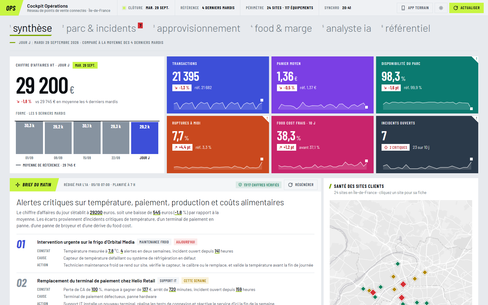

**Parc & incidents.** Disponibilité par type d'équipement, causes d'incidents séparées entre télémétrie et remontées terrain, MTTR, et repérage des équipements récidivistes (même panne au moins trois fois en dix jours ouvrés) avec une recommandation de maintenance préventive.

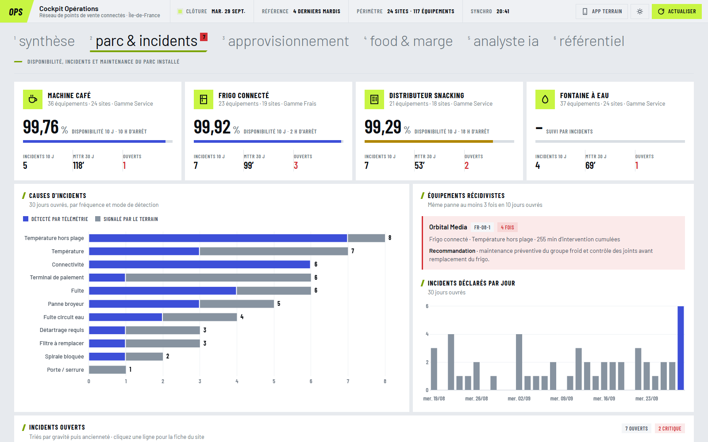

<table>
  <tr>
    <td width="50%"><b>Approvisionnement</b><br>Ponctualité des départs, heatmap des retards par tournée, ruptures à midi, classement des tournées et quantités à charger pour le lendemain.<br><br>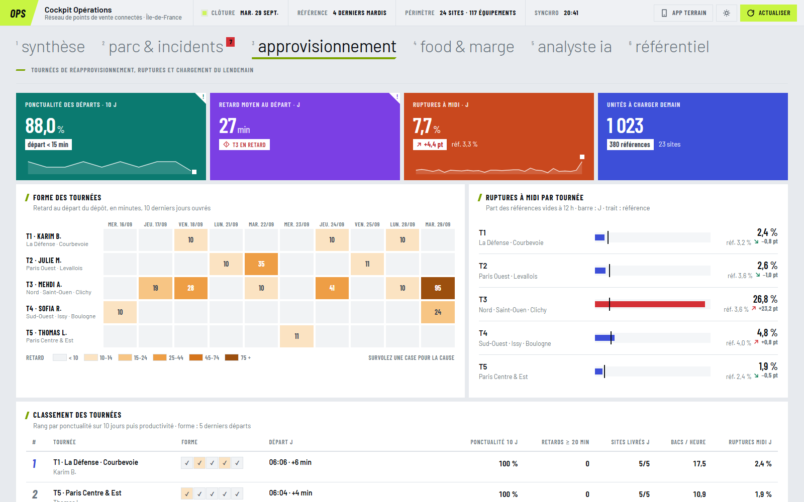</td>
    <td width="50%"><b>Food & marge</b><br>Food cost des produits frais face à la cible de chaque famille, démarque des frigos, marge brute et performance produit sur dix jours.<br><br>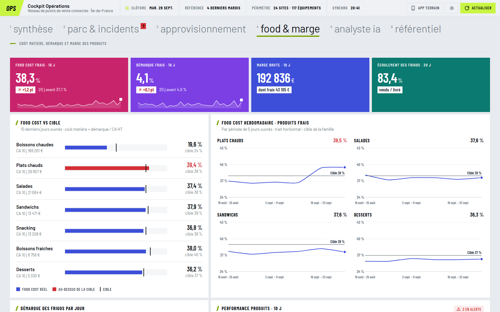</td>
  </tr>
</table>

**Référentiel.** Chaque indicateur affiché est documenté : définition, formule SQL, seuil d'alerte, fréquence et responsable. La vue liste aussi les contrôles qualité exécutés à chaque ouverture (ventes rattachées à un site connu, stock compris entre 0 et la capacité, incidents résolus avec une date de résolution...).

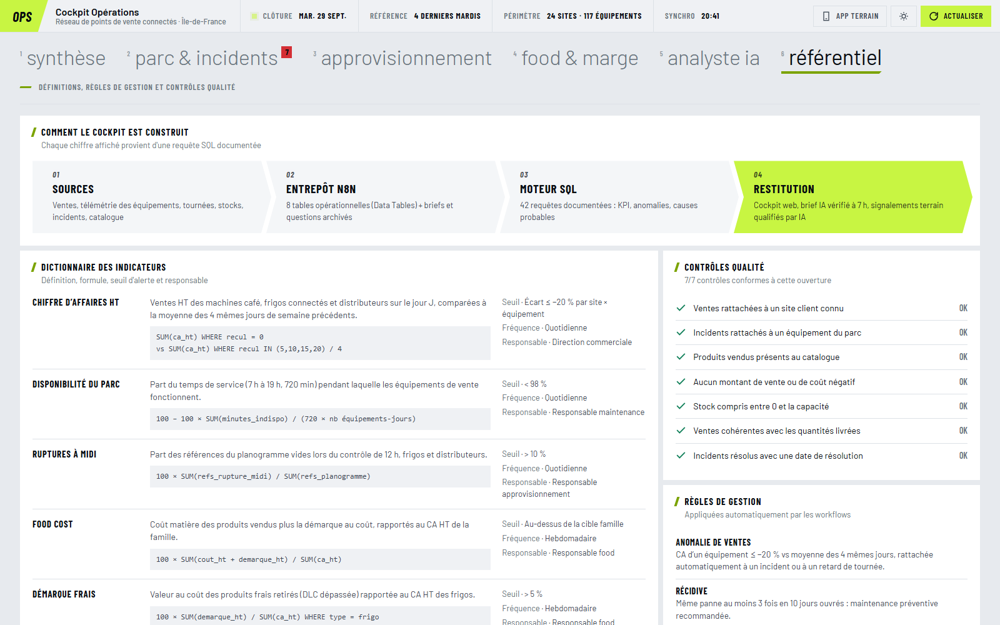

## Le brief du matin

Chaque jour ouvré à 7 h, ou à la demande depuis le cockpit, un workflow prépare des dossiers chiffrés en SQL et les envoie à un LLM qui rédige quatre priorités (constat, cause, action, équipe, échéance).

Le modèle ne calcule rien. Il reçoit des chiffres déjà calculés et doit les citer. Ensuite, un nœud Code extrait chaque nombre du texte produit et vérifie qu'il existe bien dans les résultats SQL. Le badge **17/17 chiffres vérifiés** visible dans le cockpit vient de ce contrôle. Un chiffre absent des résultats serait signalé dans le cockpit.

```js
// L'IA rédige, SQL vérifie : chaque nombre cité doit exister dans les faits
function controlerChiffres(textes, faits) {
  const autorises = nombresAutorises(faits);   // tous les nombres présents dans les résultats SQL
  for (const t of textes) {
    for (const n of extraireNombres(t)) { /* le nombre doit figurer dans autorises */ }
  }
}
```

## L'analyste IA

On pose une question en français, le modèle écrit une requête SQL, n8n la contrôle, l'exécute sur l'entrepôt, puis un second modèle rédige la réponse à partir du résultat. Le graphique, le tableau et la requête générée sont affichés avec la réponse.

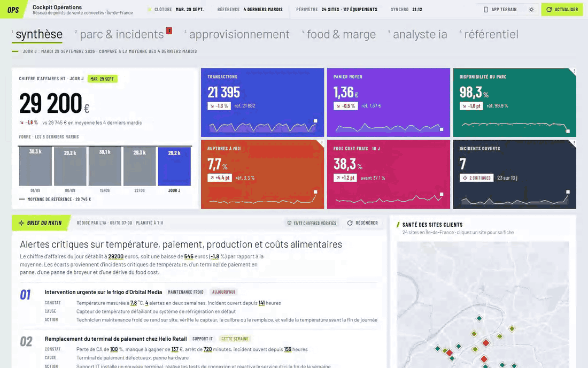

Une requête générée par un LLM n'est jamais exécutée sans contrôle :

- **lecture seule** : uniquement `SELECT` ou `WITH`, pas de `;`, et une liste de mots-clés refusés (`INSERT`, `DROP`, `INTO`, mais aussi `FILE`, `CSV`, `XLSX`, `REQUIRE`... parce qu'AlaSQL sait lire et écrire des fichiers) ;
- **tables autorisées** : chaque `FROM` et `JOIN` doit viser une des huit tables connues ou une CTE déclarée dans la requête ;
- **volume borné** : `LIMIT 200` ajouté si la requête n'en a pas ;
- **réponse vérifiée** : comme pour le brief, chaque chiffre de la réponse doit apparaître dans le résultat.

Une question hors périmètre reçoit une explication plutôt qu'une requête. Toutes les questions sont journalisées dans une Data Table.

## L'application terrain

Une page mobile, servie elle aussi par n8n, pour l'approvisionneur, le technicien ou le client. Deux modes : un signalement en texte libre (« le frigo affiche 9 degrés, les salades sont tièdes ») ou une mesure envoyée par un capteur connecté.

<table>
  <tr>
    <td width="40%">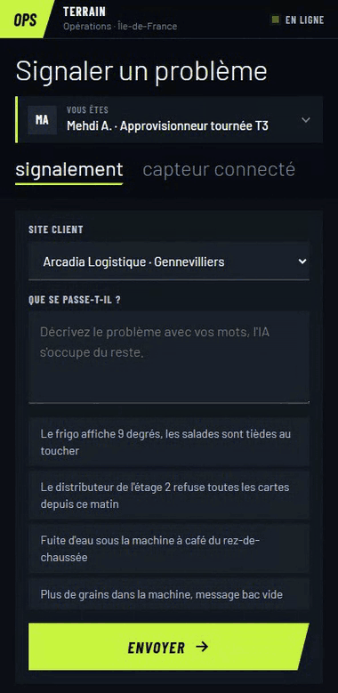</td>
    <td width="40%">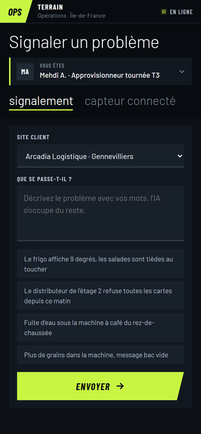</td>
  </tr>
</table>

Le traitement prend quelques secondes :

1. le modèle structure le message en JSON (équipement choisi dans la liste réelle du site, catégorie autorisée pour ce type d'équipement, gravité, équipe) ;
2. les **règles de gestion priment** sur l'IA : un frigo au-dessus de 8 °C passe en *Critique* avec retrait des produits frais, entre 6 et 8 °C la gravité est au moins *Majeure* ;
3. une requête SQL cherche un incident encore ouvert sur le même équipement pour la même panne :

```sql
SELECT i.incident_id, i.nb_signalements, i.ouvert_le, i.gravite
FROM input2 AS i
JOIN input1 AS n ON i.equip_id = n.equip_id AND i.categorie = n.categorie
WHERE i.statut <> 'Résolu'
```

S'il existe, le signalement est rattaché au ticket existant. Sinon un ticket est créé. Dans les deux cas il apparaît aussitôt dans le cockpit.

---

## Architecture


Chaque ouverture du cockpit déclenche une exécution complète : lecture des tables, 42 requêtes, génération de la page. Aucun chiffre n'est écrit en dur dans le HTML.

## Les workflows

Cinq workflows, 124 nœuds au total.

| Workflow | Déclencheur | Rôle |
|---|---|---|
| **Cockpit Opérations** | `GET /webhook/ops/cockpit` | Lit 9 tables, exécute 42 requêtes SQL, construit la page HTML |
| **Brief du matin IA** | Cron `0 7 * * 1-5` ou `POST /ops/brief` | Faits SQL, rédaction par le LLM, contrôle des chiffres, archivage |
| **Analyste IA** | `POST /ops/analyste` | Question vers SQL, garde-fous, exécution, réponse vérifiée, journal |
| **Signalements terrain** | `GET /ops/terrain`, `POST /ops/signalement` | Page mobile, qualification IA, règles de gestion, détection de doublon |
| **Initialiser les données** | Manuel | Vide les 10 tables et régénère six semaines d'activité |

**Cockpit.** Neuf lectures de Data Tables convergent vers un seul nœud SQL, puis un nœud Code assemble la page.

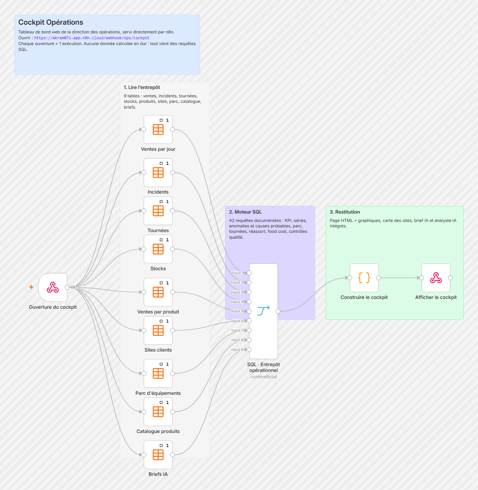

**Brief du matin.** Deux déclencheurs (planifié et à la demande) partagent la même chaîne.

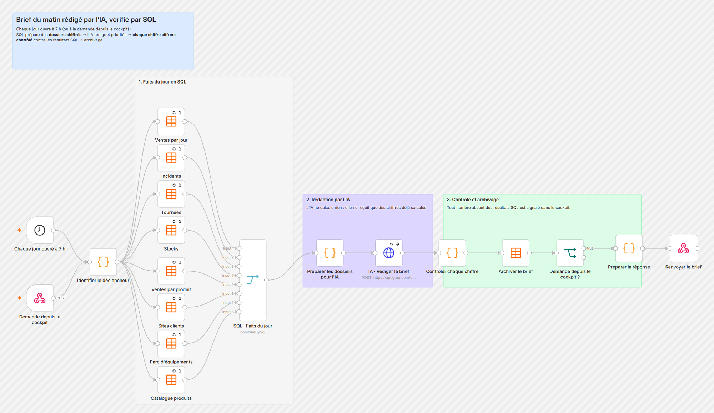

**Analyste IA.** La branche rouge porte les garde-fous : une requête refusée ne touche jamais l'entrepôt.

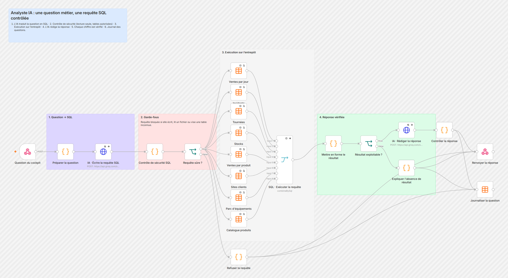

**Signalements terrain.** En haut la page mobile, en bas le traitement d'un envoi.

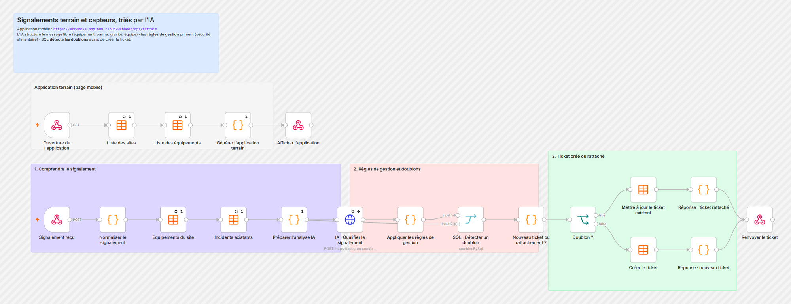

---

## Choix techniques

**SQL dans n8n, sans base de données.** Le nœud Merge de n8n a un mode `combineBySql` qui exécute une requête AlaSQL sur ses entrées (`input1`, `input2`...). Branché sur des Data Tables, il devient un petit moteur d'entrepôt : jointures, `GROUP BY`, `CASE WHEN`, fenêtres de comparaison. Toute la logique métier reste lisible dans un seul bloc SQL commenté au lieu d'être dispersée dans des nœuds Code.

```sql
-- KPI du jour J comparés à la moyenne des 4 mêmes jours précédents
SELECT 'kpi' AS bloc,
  ROUND(SUM(CASE WHEN recul = 0 THEN ca_ht ELSE 0 END), 0) AS ca_j,
  ROUND(SUM(CASE WHEN recul IN (5,10,15,20) THEN ca_ht ELSE 0 END) / 4, 0) AS ca_ref,
  ...
FROM input1
```

La colonne `recul` (nombre de jours ouvrés avant le dernier jour clôturé) simplifie toutes les comparaisons : `recul = 0` pour J, `recul IN (5,10,15,20)` pour les quatre mêmes jours des semaines précédentes.

**L'IA rédige, SQL calcule.** Les LLM ne reçoivent jamais de données brutes à agréger. Ils reçoivent des résultats déjà calculés et leur sortie est contrôlée. C'est ce qui rend le brief et l'analyste utilisables dans un contexte où un chiffre faux coûte cher.

**Sorties JSON imposées.** Tous les appels Groq utilisent `response_format: json_object` et des listes fermées (équipements du site, catégories par type, équipes). Si le modèle sort du cadre, les règles de gestion corrigent.

**Deux tailles de modèle.** `gpt-oss-120b` pour ce qui demande du raisonnement (écrire du SQL, rédiger le brief), `gpt-oss-20b` pour ce qui doit être rapide (qualifier un signalement, formuler une réponse).

**Un piège n8n.** Les nœuds Code qui agrègent toutes les lignes SQL avaient l'option *Execute Once* activée : ils ne voyaient que le premier item, et le cockpit n'affichait qu'un bloc sur 27. Option retirée, mais c'est le genre de détail qui ne se voit qu'avec des données réelles en sortie.

**Interface.** HTML, CSS et JavaScript générés par un nœud Code, avec Chart.js pour les graphiques et Leaflet pour la carte. Le système visuel (tuiles plates, navigation pivot, habillage de retransmission sportive pour le classement des tournées) a été fait pour ce projet, avec un thème clair et un thème sombre.

## Stack

| | |
|---|---|
| Orchestration | n8n cloud (webhooks, cron, Data Tables, Merge `combineBySql`, Code, HTTP Request) |
| Données | 10 Data Tables, SQL AlaSQL |
| IA | Groq, modèles `openai/gpt-oss-120b` et `openai/gpt-oss-20b` |
| Front | HTML/CSS/JS servi par webhook, Chart.js 4, Leaflet 1.9 |
